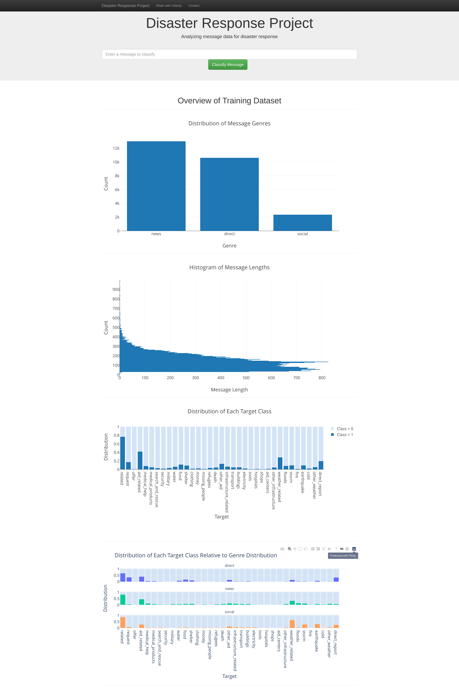

# Disaster Response Pipeline Project

## Motivation
The repository contains Machine Learning solutions for `classifying disaster response messages`. It uses text data
provided by [Appen](https://appen.com/platform-5/#data_types). Thanks to their contribution, we had public
data on which to train and test our NLP models.
The project contains three main components:
* `ETL pipeline`: it extracts data from multiple Appen data sources, transforms the data and merges it into a suitable format.
* `Modeling pipeline`: it creates features based on the ETL data, trains and evaluates different models.
* `Web app`: it allows the user to interact with the model and see the results.

The solution classifies messages based on the following targets:
* related
* request
* offer
* aid_related
* medical_help
* medical_products
* search_and_rescue
* security
* military
* water
* food
* shelter
* clothing
* money
* missing_people
* refugees
* death
* other_aid
* infrastructure_related
* transport
* buildings
* electricity
* tools
* hospitals
* shops
* aid_centers
* other_infrastructure
* weather_related
* floods
* storm
* fire
* earthquake
* cold
* other_weather
* direct_report

## Some Cool Screenshots of the App
### Data Analysis

### Model In Action


## Install
The code was run with:
* Ubuntu 20.4
* Python 3.7

Create & activate a conda environment with:
```shell
conda create --name disaster-response-classification python=3.7
conda activate disaster-response-classification
```
Install all the requirements:
```shell
pip install -r requirements.txt
```

## Usage
### File Description
```
 disaster_response_pipeline
          |-- app
                |-- templates
                        |-- go.html
                        |-- master.html
                |-- plots.py
                |-- run.py
          |-- data
                |-- disaster_message.csv
                |-- disaster_categories.csv
                |-- DisasterResponse.db
                |-- process_data.py
          |-- models
                |-- classifier.pkl
                |-- train_classifier.py
          |-- Preparation
                |-- ETL Pipeline Preparation.ipynb
                |-- ML Pipeline Preparation.ipynb
          |-- README
```

### Instructions
#### Step 1
Run the ETL pipeline:
```shell
python data/process_data.py -messages-filepath data/disaster_messages.csv -categories-filepath data/disaster_categories.csv -database-filepath data/data.db
```
#### Step 2
Train the model:
```shell
python models/train_classifier.py -database-filepath data/data.db -model-filepath models/classifier.pkl -config-filepath models/config.yaml
```
Hyperparameter tuning with GridSearchCV:
```shell
python models/train_classifier.py -database-filepath data/data.db -model-filepath models/classifier.pkl -config-filepath models/config_gridsearch.yaml.yaml -gridsearch True
```
#### Step 3
Run the web app:
```shell
python app/run.py
```
To access the web app, open a browser and navigate to `http://localhost:3001/`

## Licensing, Authors, Acknowledgements
The code is licensed under the MIT license. I encourage anybody to use and share the code as long as you give credit to the original author.
I want to give my full gratitude to [Appen](https://appen.com/platform-5/#data_types) for their contribution to the data. Without their contribution, I would not have been able to train the model.

If anybody has any machine learning questions, suggestions or wants to collaborate with me, feel free to contact me at `p.b.iusztin@gmail.com` or on my [LinkedIn Page](https://www.linkedin.com/in/paul-iusztin-7a047814a/).